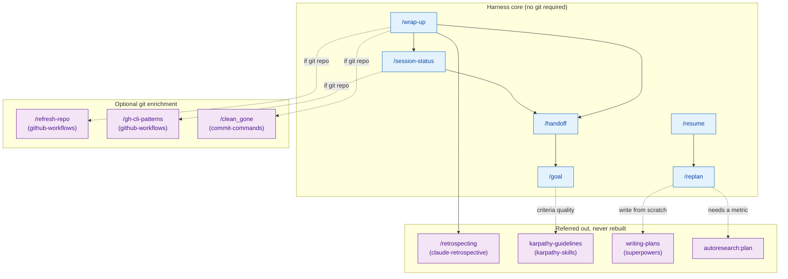
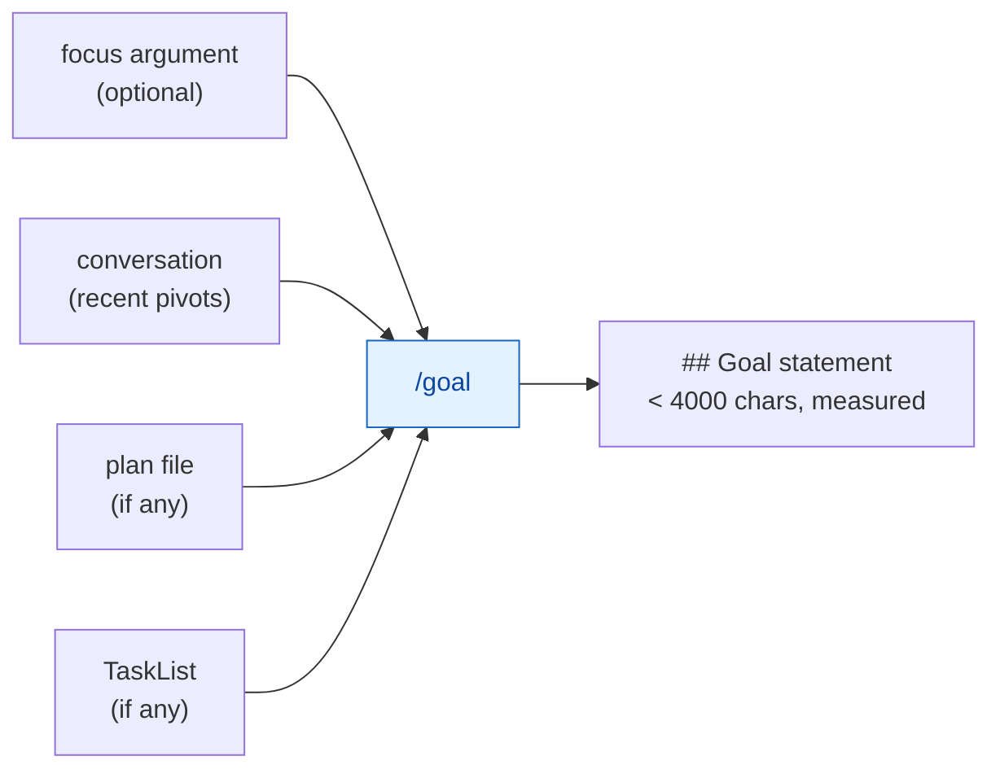

# ai-cli-harness-better-practices — Architecture

Session continuity for AI CLI harnesses. No skill here requires a git
repository; git and GitHub are optional enrichment, guarded per skill.

## Skill Map



## The git guard

Every enrichment section is gated by one check:

```bash
git rev-parse --is-inside-work-tree >/dev/null 2>&1
```

Success runs the section. Failure skips it and the skill states the omission in
its output. Nothing errors; nothing is silently dropped.

**The guard proves repo-ness, not GitHub reachability.** They are different
conditions and a repository can satisfy the first while failing the second: no
`origin` remote, a non-GitHub remote, `gh` not installed, or `gh` unauthenticated.
So any `gh` call inside a gated block carries its own failure handling — treat a
non-zero `gh` exit as "unknown", never as "none found", and say which check did
not run. Reporting an unchecked list as clean is the failure this whole design
exists to prevent.

Commands that name a default branch use the repository's actual default, not a
hardcoded `main`:

```bash
git symbolic-ref --short refs/remotes/origin/HEAD 2>/dev/null   # e.g. origin/develop
```

## /goal composition

`/goal` is the atom. It has no dependencies, reads no repository, and writes no
files. `/handoff` calls it for the goal half of its artifact rather than
carrying a second definition of what a goal statement is.



Any missing input is skipped. All three state sources missing still yields a
goal derived from the conversation alone.
