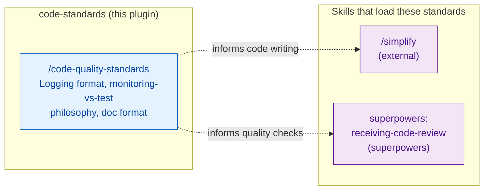

# code-standards — Architecture

Passive knowledge plugin providing estate-specific code conventions. This skill is
loaded on demand — it does not run automatically like a hook.

## Integration Map

Generic review process, feedback format, and severity levels are covered by
`superpowers:receiving-code-review` and the official `code-review:code-review`
and `engineering:code-review` skills, not duplicated here.

## Passive vs Active

Standards plugins provide context when loaded — they do not block, intercept, or
modify operations. For active enforcement of coding patterns, see
[git-guards/ARCHITECTURE.md](../git-guards/ARCHITECTURE.md) and
[content-guards/ARCHITECTURE.md](../content-guards/ARCHITECTURE.md).
