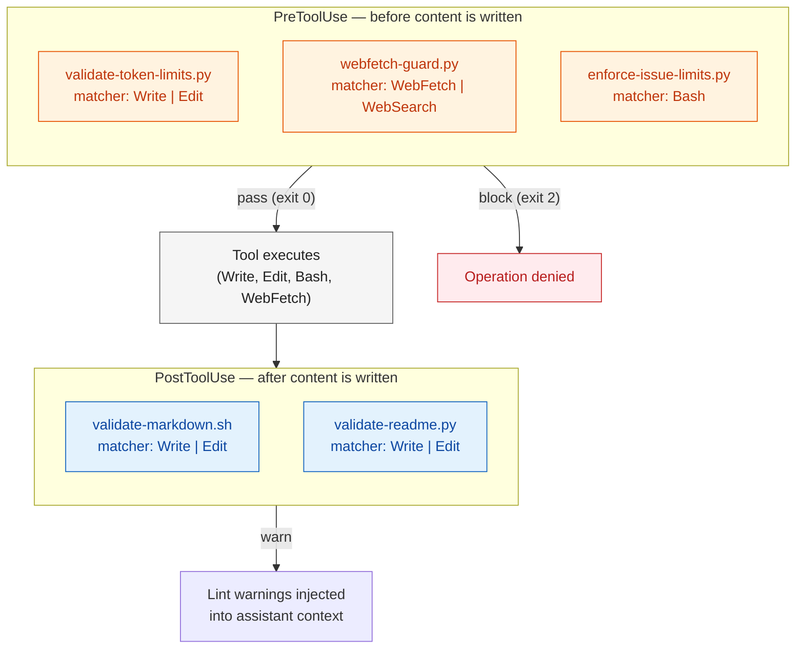

# content-guards — Architecture

Pre-flight and post-flight content validation through 6 hooks across PreToolUse and
PostToolUse events. These run automatically on every qualifying tool call.

## Validation Pipeline

## Hook Details

| Hook | Event | Matcher | What It Does |
|------|-------|---------|-------------|
| token-validator | PreToolUse | Write, Edit | Blocks files exceeding token limits |
| leakage-guard | PreToolUse | Write, Edit | Blocks private host IPs / VMIDs in public-repo writes |
| webfetch-guard | PreToolUse | WebFetch, WebSearch | Blocks outdated year references in queries |
| issue-limiter | PreToolUse | Bash | Caps OPEN issues/PRs, blocks duplicate titles |
| markdown-validator | PostToolUse | Write, Edit | Runs markdownlint on written files |
| readme-validator | PostToolUse | Write, Edit | Checks README required sections and badges |

## Where Guards Fire

These hooks run on every file write across all workflows — `/ship`, `/finalize-pr`,
`/resolve-pr-threads`, manual edits, and any other skill that writes files.

See [git-guards/ARCHITECTURE.md](../git-guards/ARCHITECTURE.md) for the companion
runtime protection hooks.
