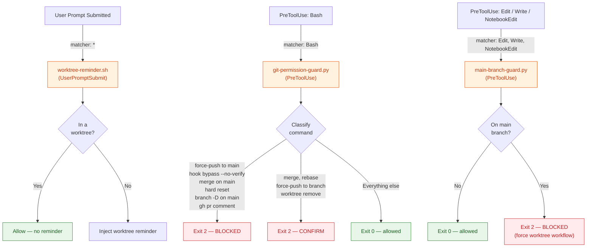
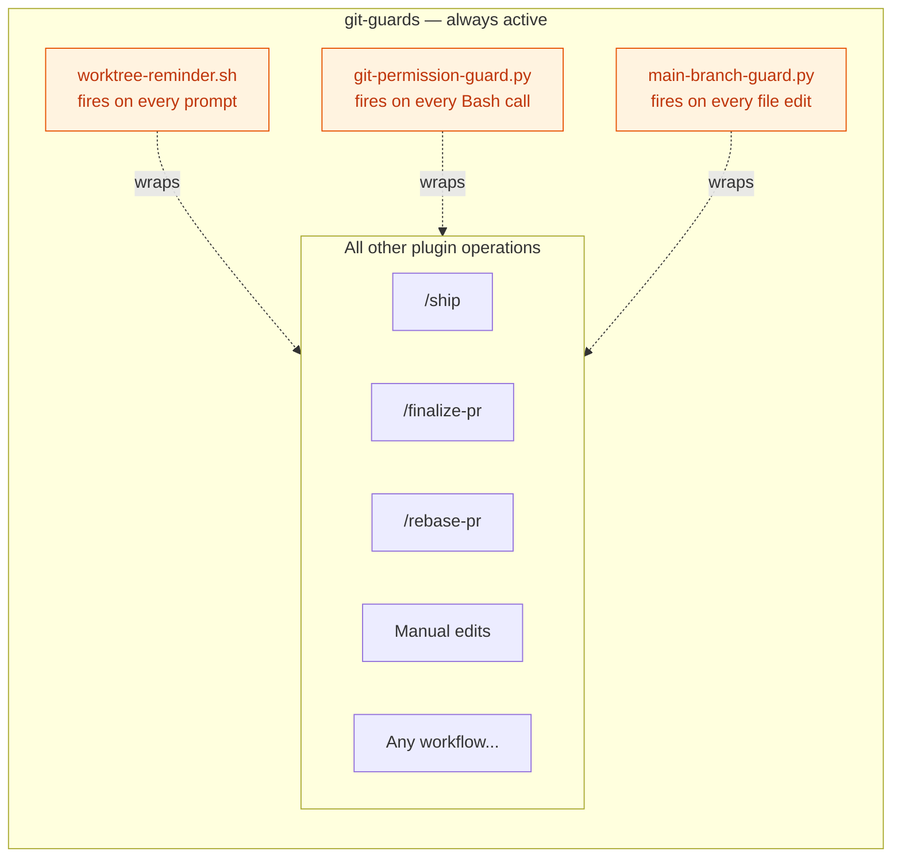

# git-guards — Architecture

Always-on protection through three hooks that intercept operations across every workflow.
Unlike guidance-based plugins that load on demand, these hooks run unconditionally for
every user prompt and every tool invocation.

## Hook Interception Map

## Always-On Nature

These hooks wrap around every other plugin operation. No workflow bypasses them.

## Fail-Open Philosophy

Every hook follows a strict fail-open contract: if the hook errors or crashes, it exits 0
and allows the operation. Only an explicit decision to block produces exit 2.

| Outcome | Exit Code | Effect |
|---------|-----------|--------|
| Intentional allow | 0 | Operation proceeds |
| Intentional block | 2 | Operation denied |
| Hook crash / error | 0 | Fail-open — proceeds anyway |

## Relationship to git-standards

git-guards and git-standards are complementary: one enforces, one advises.

| Dimension | git-guards | git-standards |
|-----------|-----------|---------------|
| Activation | Automatic — every operation | On demand — loaded when relevant |
| Mechanism | Hook exit codes (0/2) | Skill text injected into context |
| Effect | Hard block or reminder | Soft guidance and conventions |
| Scope | Runtime tool calls | Planning and workflow decisions |
