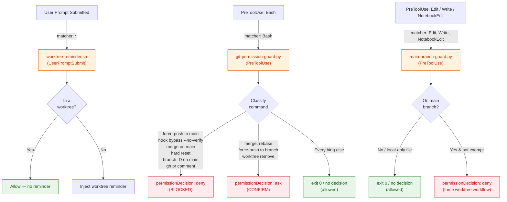
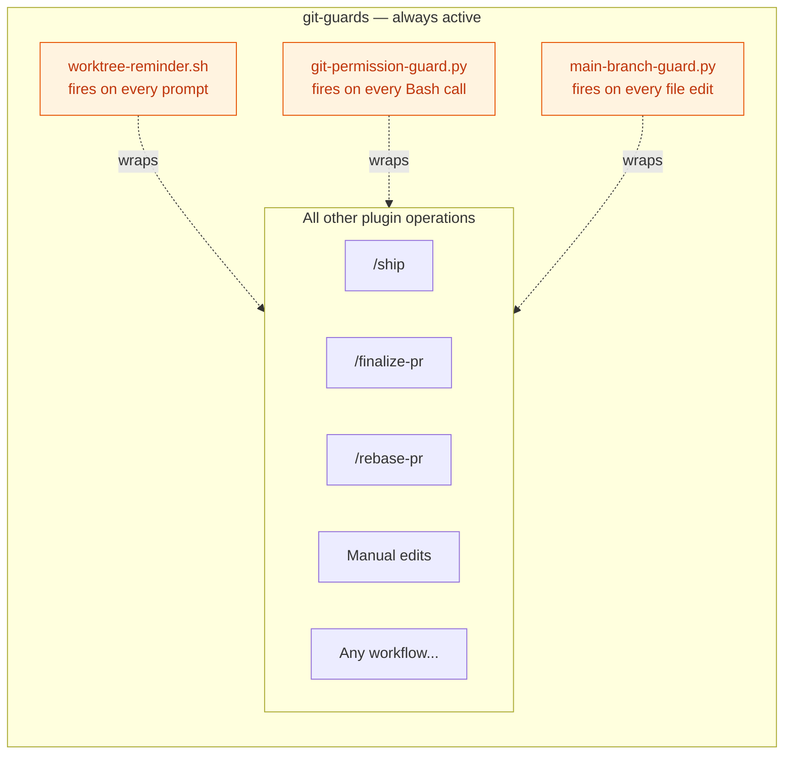

# git-guards — Architecture

Always-on protection through three hooks that intercept operations across every workflow.
Unlike guidance-based plugins that load on demand, these hooks run unconditionally for
every user prompt and every tool invocation.

## Hook Interception Map



## Always-On Nature

These hooks wrap around every other plugin operation. No workflow bypasses them.



## Fail-Open Philosophy

Every hook follows a strict fail-open contract: if the hook errors or crashes, it exits 0
with no decision and the operation proceeds. Blocking is signalled by emitting a JSON
`permissionDecision` (`deny` or `ask`) on stdout while still exiting 0; the worktree
reminder writes a stderr message instead. The legacy exit-2 path (still used by
`worktree-reminder.sh`) is preserved for shell hooks but no longer used by the Python
guards.

| Outcome | Mechanism | Effect |
|---------|-----------|--------|
| Intentional allow | exit 0, no decision | Operation proceeds |
| Intentional block | exit 0 with `permissionDecision: deny` | Operation denied |
| User confirmation | exit 0 with `permissionDecision: ask` | User prompted |
| Hook crash / error | exit 0 (no JSON) | Fail-open — proceeds anyway |

## Relationship to git-standards

git-guards and git-standards are complementary: one enforces, one advises.

| Dimension | git-guards | git-standards |
|-----------|-----------|---------------|
| Activation | Automatic — every operation | On demand — loaded when relevant |
| Mechanism | Hook exit codes (0/2) | Skill text injected into context |
| Effect | Hard block or reminder | Soft guidance and conventions |
| Scope | Runtime tool calls | Planning and workflow decisions |

## Testing

### Branch Isolation in Guard Tests

`git-permission-guard.py` calls `_is_on_main_branch()` to gate `BLOCKED_ON_MAIN`
commands (`git commit`, `git add`, `git push`). Test files that invoke the guard
via `subprocess.run` must prevent this check from returning `True` when CI runs
against the `main` branch — otherwise BLOCKED_ON_MAIN fires before the path under
test is reached, masking real failures.

**Preferred — `GIT_GUARD_BRANCH_OVERRIDE` env var** (guard-level override, no
filesystem side-effects):

```python
import os

_TEST_ENV = {**os.environ, "GIT_GUARD_BRANCH_OVERRIDE": "feature"}

def run(cmd: str) -> dict:
    result = subprocess.run(
        ["python3", str(SCRIPT)],
        input=inp,
        capture_output=True,
        text=True,
        env=_TEST_ENV,
    )
```

**Alternative — temp directory `cwd`** (also isolates the test from the real repo):

```python
import atexit, shutil, tempfile

_TMPDIR = tempfile.mkdtemp(prefix="test_guard_")
atexit.register(shutil.rmtree, _TMPDIR, ignore_errors=True)

def run(cmd: str) -> dict:
    result = subprocess.run(
        ["python3", str(SCRIPT)],
        input=inp,
        capture_output=True,
        text=True,
        cwd=_TMPDIR,  # non-git dir: _is_on_main_branch() fails open
    )
```

Use `GIT_GUARD_BRANCH_OVERRIDE` when the test must run from the repo root (e.g.
to exercise git-aware behaviour). Use `cwd=_TMPDIR` when full filesystem isolation
is also required. Never omit both — BLOCKED_ON_MAIN will fire on `main`-branch CI
runs and mask the real test intent.