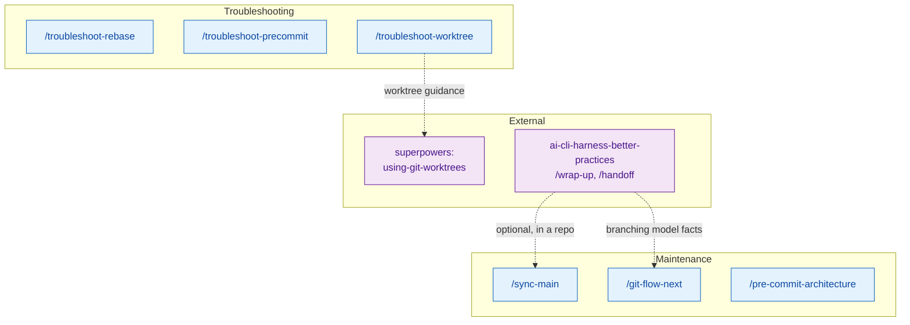

# git-workflows — Architecture

Local git operations: branch sync and troubleshooting.

For PR-related operations (refresh, rebase-merge, finalize, squash-merge), see
[github-workflows/ARCHITECTURE.md](../github-workflows/ARCHITECTURE.md).

Session-continuity skills (`/goal`, `/session-status`, `/handoff`, `/resume`,
`/replan`, `/wrap-up`) are **not** here. They moved to
[ai-cli-harness-better-practices](../ai-cli-harness-better-practices/ARCHITECTURE.md)
because they are harness concerns, not git concerns — they run with or without a
repository and treat git as one evidence source among several.

## Skill Map

## Plugin Boundary: Session vs Local vs GitHub

```mermaid
flowchart LR
    classDef ai fill:#e3f2fd,stroke:#1565c0,color:#0d47a1
    classDef external fill:#f3e5f5,stroke:#6a1b9a,color:#4a148c

    subgraph harness["ai-cli-harness-better-practices — SESSION state"]
        direction TB
        cont["/goal, /session-status, /handoff\n/resume, /replan, /wrap-up"]:::external
    end

    subgraph local["git-workflows — LOCAL git operations"]
        direction TB
        sync_main["/sync-main\ngit pull, branch sync"]:::ai
        ts["/troubleshoot-*\nrebase, precommit, worktree"]:::ai
        git_flow["/git-flow-next\nbranching model"]:::ai
    end

    subgraph remote["github-workflows — GITHUB API operations"]
        direction TB
        refresh_repo["/refresh-repo"]:::external
        rebase_pr["/rebase-pr"]:::external
        finalize_pr["/finalize-pr"]:::external
        squash_merge_pr["/squash-merge-pr"]:::external
        resolve_threads["/resolve-pr-threads"]:::external
        shape_issues["/shape-issues"]:::external
        trigger_reviews["/trigger-ai-reviews"]:::external
    end

    harness -- "calls down when\nthe cwd is a repo" --> local
    harness -- "calls down when\nthe cwd is a repo" --> remote
    local -- "hands off after\npush to remote" --> remote
```

The arrows point one way on purpose. Harness skills may call into git and GitHub
skills; git and GitHub skills never depend on session state.
