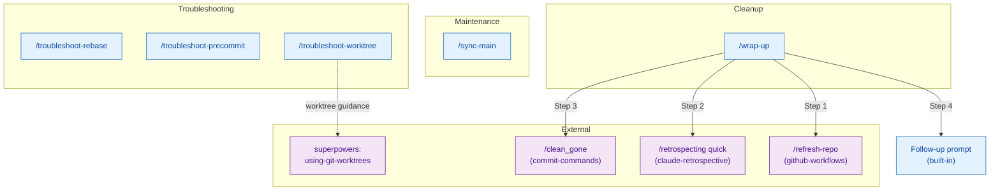
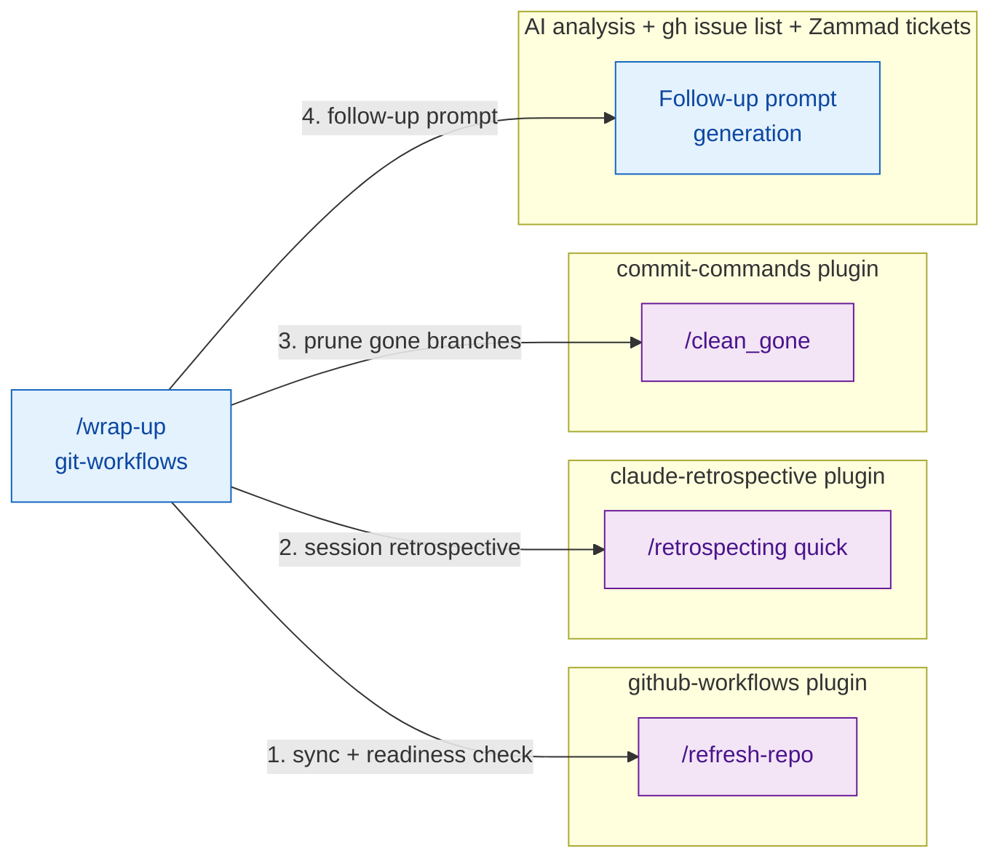

# git-workflows — Architecture

Local git operations: branch sync, troubleshooting, and post-merge cleanup.
For PR-related operations (refresh, rebase-merge, finalize, squash-merge), see
[github-workflows/ARCHITECTURE.md](../github-workflows/ARCHITECTURE.md).

## Skill Map

## /wrap-up Composition

## Plugin Boundary: Local vs GitHub

```mermaid
flowchart LR
    classDef ai fill:#e3f2fd,stroke:#1565c0,color:#0d47a1
    classDef external fill:#f3e5f5,stroke:#6a1b9a,color:#4a148c

    subgraph local["git-workflows — LOCAL git operations"]
        direction TB
        sync_main["/sync-main\ngit pull, branch sync"]:::ai
        ts["/troubleshoot-*\nrebase, precommit, worktree"]:::ai
        wrap_up["/wrap-up\nend-of-session cleanup"]:::ai
    end

    subgraph remote["github-workflows — GITHUB API operations"]
        direction TB
        refresh_repo["/refresh-repo"]:::external
        rebase_pr["/rebase-pr"]:::external
        finalize_pr["/finalize-pr"]:::external
        squash_merge_pr["/squash-merge-pr"]:::external
        resolve_threads["/resolve-pr-threads"]:::external
        shape_issues["/shape-issues"]:::external
        trigger_reviews["/trigger-ai-reviews"]:::external
    end

    local -- "hands off after\npush to remote" --> remote
```

