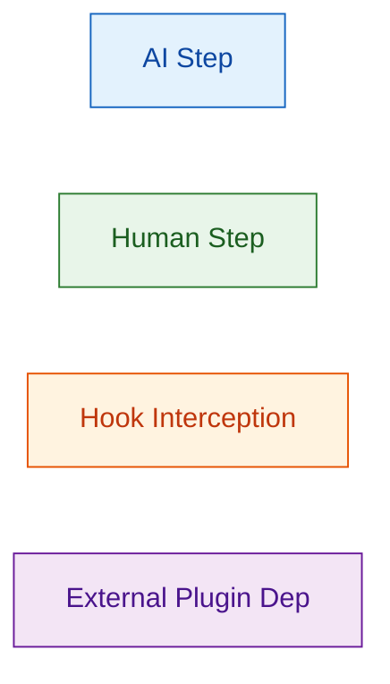
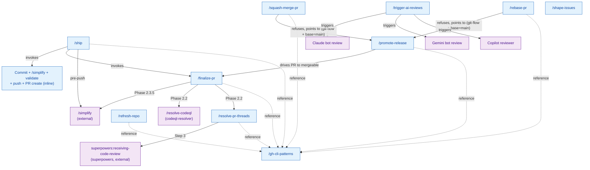

# github-workflows — Architecture

Cross-plugin integration diagrams for the `github-workflows` plugin. This is the master
pipeline reference for the full PR lifecycle, from uncommitted changes through post-merge cleanup.

---

## Legend

---

## 1. Skill Dependency Map

All skills and their cross-plugin dependencies. `/refresh-repo`, `/rebase-pr`,
`/squash-merge-pr`, `/promote-release`, and `/gh-cli-patterns` are local to this
plugin (no cross-plugin hop) — `/squash-merge-pr`, `/rebase-pr`, and
`/promote-release` all consume the canonical PR-readiness gate and the
default-branch detection from `/gh-cli-patterns` directly. On a git-flow repo,
`/squash-merge-pr` and `/rebase-pr` both refuse a `main`-targeting PR and point
to `/promote-release` instead.

`/shape-issues` is standalone — uses Shape Up methodology with no runtime dependency
on other plugins.

---

## 2. The Ship Pipeline

The complete end-to-end journey from uncommitted changes to a merged, clean repository.

```mermaid
flowchart TD
    subgraph AI_SHIP ["AI — Automated (/ship)"]
        direction TB
        S0["Verify working directory"]:::ai
        S1["Detect uncommitted changes"]:::ai
        S2["Commit, /simplify, validate,\npush, PR create (inline)"]:::ai
        S3["Build context brief\n(purpose, decisions, scope)"]:::ai
        S4["pr-lifecycle hook fires\npost-pr-create.sh"]:::hook
        S5["Invoke /finalize-pr\n(sequential per PR)"]:::ai

        subgraph FINALIZE ["AI — /finalize-pr phases"]
            direction TB
            F1["Phase 1: Discover + confirm PRs"]:::ai
            F15["Phase 1.5: Build context brief\n(if standalone invocation)"]:::ai
            F21["Phase 2.1: Start CI monitoring\n(background Task agent)"]:::ai
            F22A["Phase 2.2a: Fix CodeQL\n/resolve-codeql (codeql-resolver)"]:::external
            F22B["Phase 2.2b: Fix review threads\n/resolve-pr-threads"]:::ai
            F22C["Phase 2.2c: Fix merge conflicts"]:::ai
            F23["Phase 2.3: Fix CI failures"]:::ai
            F235["Phase 2.3.5: /simplify\nfinal pass"]:::external
            F24["Phase 2.4: Health check"]:::ai
            F3["Phase 3: Pre-handoff verification\nCodeQL, threads, conflicts,\nsimplified, CI, local lint"]:::ai
            F4["Phase 4: Update PR metadata\n(haiku subagent)"]:::ai
            F5["Phase 5: Report ready"]:::ai
        end

        S0 --> S1 --> S2 --> S3 --> S4 --> S5
        S5 --> F1 --> F15 --> F21
        F21 --> F22A & F22B & F22C
        F22A & F22B & F22C --> F23 --> F235 --> F24 --> F3 --> F4 --> F5
    end

    subgraph HUMAN ["HUMAN — Decision Point"]
        direction TB
        H1["Review PR on GitHub"]:::human
        H2{"Approve or\nRequest changes?"}:::human
        H3["AI resolves via\n/resolve-pr-threads"]:::ai
        H4["Decision: merge"]:::human

        H1 --> H2
        H2 -->|"Changes requested"| H3 --> H1
        H2 -->|"Approved"| H4
    end

    subgraph MERGE ["AI — On Human Command (/squash-merge-pr)"]
        direction TB
        M0["Step 0: refuse if base=main\non a git-flow repo\n(see /promote-release)"]:::ai
        M1["Validate readiness\n(/gh-cli-patterns PR-readiness gate)"]:::ai
        M2["Generate squash commit"]:::ai
        M3["gh pr merge --squash\n--delete-branch"]:::ai
        M4["git switch base branch && git pull"]:::ai

        M0 --> M1 --> M2 --> M3 --> M4
    end

    subgraph CLEANUP ["AI — On Human Command (/wrap-up from git-workflows)"]
        direction TB
        W1["/refresh-repo\n(this plugin)"]:::ai
        W2["/retrospecting quick\n(claude-retrospective, external)"]:::external
        W3["/clean_gone\n(commit-commands, external)"]:::external
        W4["Summary report"]:::ai

        W1 --> W3 --> W4
        W2 --> W4
    end

    F5 --> H1
    H4 --> M1
    M4 --> CLEANUP

    classDef ai fill:#e3f2fd,stroke:#1565c0,color:#0d47a1
    classDef human fill:#e8f5e9,stroke:#2e7d32,color:#1b5e20
    classDef hook fill:#fff3e0,stroke:#e65100,color:#bf360c
    classDef external fill:#f3e5f5,stroke:#6a1b9a,color:#4a148c
```

---

## 3. Guard Integration

`git-guards` and `content-guards` hooks intercept tool calls throughout the entire pipeline.
They fire automatically on every `Bash`, `Write`, `Edit`, and `NotebookEdit` call made by
any skill — they are not invoked explicitly.

See [git-guards/ARCHITECTURE.md](../git-guards/ARCHITECTURE.md) and
[content-guards/ARCHITECTURE.md](../content-guards/ARCHITECTURE.md) for details.

---

## 4. Cross-References

- [codeql-resolver/ARCHITECTURE.md](../codeql-resolver/ARCHITECTURE.md) — 3-tier
  architecture (invoked by `/finalize-pr` Phase 2.2)
- [git-workflows/ARCHITECTURE.md](../git-workflows/ARCHITECTURE.md) — `/sync-main`,
  `/wrap-up`, `/troubleshoot-*`
- [pr-lifecycle/ARCHITECTURE.md](../pr-lifecycle/ARCHITECTURE.md) — PostToolUse hook
  bridging `gh pr create` to `/finalize-pr`
- [git-guards/ARCHITECTURE.md](../git-guards/ARCHITECTURE.md) — PreToolUse hooks
- [content-guards/ARCHITECTURE.md](../content-guards/ARCHITECTURE.md) — Content validation
- [code-standards/ARCHITECTURE.md](../code-standards/ARCHITECTURE.md) — Quality standards
- [git-standards/ARCHITECTURE.md](../git-standards/ARCHITECTURE.md) — Git conventions
