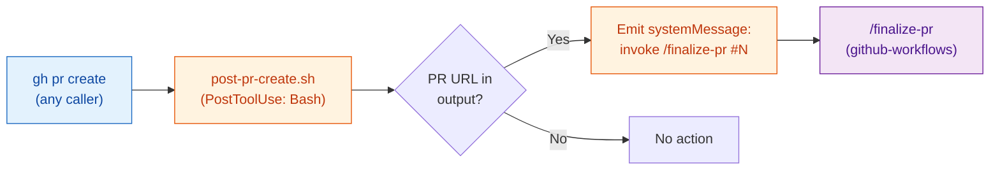

# pr-lifecycle — Architecture

PostToolUse hook that bridges PR creation to PR finalization. Detects successful
`gh pr create` commands and automatically triggers `/finalize-pr`.

## Bridge Diagram

## Callers

| Caller | Uses pr-lifecycle hook? |
|--------|----------------------|
| `/commit-push-pr` (commit-commands) | Yes — hook fires after `gh pr create` |
| `/ship` (github-workflows) | Yes, but its systemMessage is ignored — `/ship` invokes `/finalize-pr` directly |
| Manual `gh pr create` | Yes — hook fires on any Bash `gh pr create` |

When `/ship` is the orchestrator, it suppresses this hook's systemMessage and invokes
`/finalize-pr` itself with the context brief from Step 1.5.

## Cross-References

- [github-workflows/ARCHITECTURE.md](../github-workflows/ARCHITECTURE.md) — master
  pipeline showing where this hook fits
