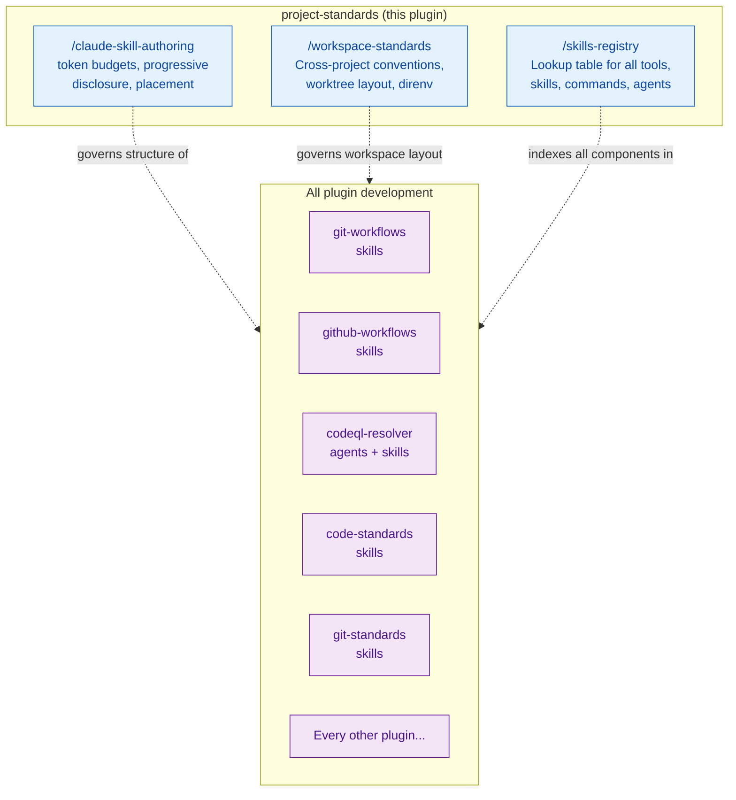

# project-standards — Architecture

Meta-plugin governing the structure and conventions of all other plugins. Provides
authoring standards for Claude skills/agents/rules, workspace conventions, and a registry of all
available tools and skills.

## Integration Map

## Meta-Plugin Role

This plugin does not participate in any runtime workflow. It provides reference
documentation that governs how all other plugins are authored and organized:

- **/claude-skill-authoring** — token budgets, progressive disclosure, placement, naming
- **/workspace-standards** — worktree layout, cross-repo conventions, direnv
- **/skills-registry** — canonical lookup for discovering available capabilities
